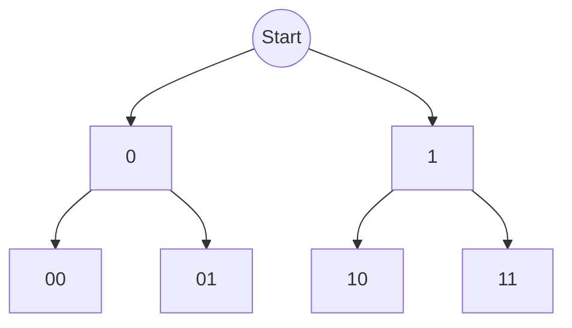

# Backtracking 

Backtracking is an algorithm which build solutions in a brute force manner where a candidate is added, evaluation is done and them removed and repeat. 

## Algorithm 

A standard template for backtrackking is as below:

```python 
def backtrack(candidate):
    if is_solution(candidate):
        output(candidate)
        return

    for next_choice in potential_choices:
        if is_valid(next_choice, candidate):
            add(next_choice, candidate)  # Make choice
            backtrack(candidate)         # Explore
            remove(next_choice, candidate) # Undo (Backtrack)
```

The key is to find out when to break from the recursive loop and the way to send the candidates. 


A method to do so is to visualise a tree-like structure.

For example, consider generating all binary strings of length 2 using backtracking:

```python
def generate_binary(n, prefix=""):
    if n == 0:
        print(prefix)
        return
    generate_binary(n-1, prefix + "0")
    generate_binary(n-1, prefix + "1")

generate_binary(2)
# Output:
# 00
# 01
# 10
# 11
```

The recursion tree for `generate_binary(2)` looks like this:



## When do we use backtracking? 

A good rule of thumb: use backtracking when you need to generate permutations, combinations, or subsequences.

After that, consider whether you can memoize any part of your computation to avoid redundant work. If so, you can often transition from plain backtracking to backtracking with memoization (also known as top-down dynamic programming), and then possibly to a bottom-up dynamic programming approach.

## Example Problems

TODO: Add exercises

## References

TODO: Add references used for exercises. 