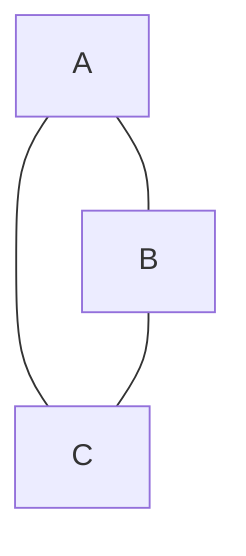
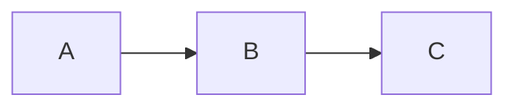
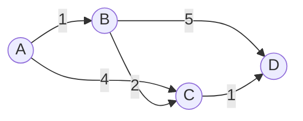

# Graphs

A few terms: 
1. Weighted: The edge between the two nodes have a value. Used in neural networks.

2. Directed: The edges point in a particular direction. 

Undirected graph:



Directed example (A -> B, B -> C):



There are 2 ways to represent graphs: 

### 1. Adjacency List

We maintain a dictionary with the keycs being the nodes and the neighbours being the values. 

```python
# adjacency list using sets for neighbours
adj_list = {
	'A': {'B', 'C'},
	'B': {'A', 'C'},
	'C': {'A', 'B'},
}
```

### 2. Adjacency Matrix

We have a matrrix where the y axis represents the nodes and the x axis represents the relationship of the nodes to other nodes. 

### Adjacency matrix (rows = from, cols = to)

|   | A | B | C |
|---|---:|---:|---:|
| A | 0 | 1 | 1 |
| B | 1 | 0 | 1 |
| C | 1 | 1 | 0 |

(1 indicates an edge; 0 indicates no edge)

## Algorithms 

### BFS (Breadth-First Search)

Starting at A, BFS visits nodes in layers using a queue (FIFO).

Initial:
- queue: [A]
- visited: {}

Step 1: pop A
- queue: []
- visit A -> visited = {A}
- enqueue neighbours B, C -> queue = [B, C]

Step 2: pop B
- queue: [C]
- visit B -> visited = {A, B}
- enqueue neighbour C (already in queue/visited) -> queue stays [C]

Step 3: pop C
- queue: []
- visit C -> visited = {A, B, C}

BFS order: A, B, C

### DFS (Depth-First Search) 

Using a stack (LIFO) and visiting when popped or when pushed (two common variants). This trace uses push-then-mark approach for clarity.

Initial:
- stack: [A]
- visited: {}

Step 1: pop A
- stack: []
- visit A -> visited = {A}
- push neighbours (in reverse sorted order if you want deterministic): push C, then B -> stack = [C, B]

Step 2: pop B
- stack: [C]
- visit B -> visited = {A, B}
- push B's neighbours (C and A). C already in stack/visited; A already visited -> stack stays [C]

Step 3: pop C
- stack: []
- visit C -> visited = {A, B, C}

DFS order (one valid order): A, B, C

Note: DFS order depends on neighbor ordering; sorting or using lists instead of sets will make it deterministic.

### Dijkstra's Algorithm (Shortest Path)

Note: Used for graphs with positive weights. 

Dijkstra finds shortest paths from a single source using a min‑heap of (distance, node) and edge relaxation. Example graph (weights shown):



Example trace starting at A (initial dist: A=0, B=∞, C=∞, D=∞). Heap entries shown as (distance,node). Stale heap entries may appear and are ignored when popped (d > dist[u]).

| Step | Action (popped) | Heap after push | Distances (A,B,C,D) | Predecessors (A,B,C,D) |
|------|-----------------|-----------------|----------------------|-------------------------|
| 0 (init) | — | [(0,A)] | 0, ∞, ∞, ∞ | -, -, -, - |
| 1 | pop (0,A) — relax A→B(1), A→C(4) | [(1,B), (4,C)] | 0, 1, 4, ∞ | -, A, A, - |
| 2 | pop (1,B) — relax B→C(2) → update C=3; B→D(5) → D=6 | [(3,C), (4,C), (6,D)] | 0, 1, 3, 6 | -, A, B, B |
| 3 | pop (3,C) — relax C→D(1) → update D=4 | [(4,C), (6,D), (4,D)] | 0, 1, 3, 4 | -, A, B, C |
| 4 | pop (4,C) — stale (4 > dist[C]=3) → skip | [(4,D), (6,D)] | 0, 1, 3, 4 | -, A, B, C |
| 5 | pop (4,D) — relax none | [(6,D)] | 0, 1, 3, 4 | -, A, B, C |
| 6 | pop (6,D) — stale (6 > 4) → skip; heap empty → done | [] | 0, 1, 3, 4 | -, A, B, C |

Final shortest distances from A: A=0, B=1, C=3, D=4. Reconstruct a path to D using predecessors: D ← C ← B ← A → path A → B → C → D.

Notes
- The heap can contain multiple entries for the same node; check for stale entries when popped (if popped distance > current dist, skip).
- Complexity (binary heap): time O((V+E) log V), space O(V).
- Requires non‑negative edge weights; for negative weights use Bellman–Ford.
- Use the predecessor map (prev) to reconstruct paths by walking from target back to source and reversing.

## Implementations

1. [01_adjacency_list.py](01_adjacency_list.py) - Class-based implementation of graphs using an adjacency list.  
2. [02_DFS.py](02_DFS.py) - Depth-First Search (DFS) quick implementation.  
3. [03_BFS.py](03_BFS.py) - Breadth-First Search (BFS) quick implementation.  
4. [04_Dijkstra_Algo.py](04_Dijkstra_Algo.py) - Dijkstra's shortest-path algorithm implementation.  

#### References
1. https://www.youtube.com/watch?v=rHemTXFJIPM
2. https://www.freecodecamp.org/news/dijkstras-shortest-path-algorithm-visual-introduction/
3. https://www.youtube.com/watch?v=tWVWeAqZ0WU&pp=ygUTZnJlZWNvZGVjYW1wIGdyYXBoIA%3D%3D
