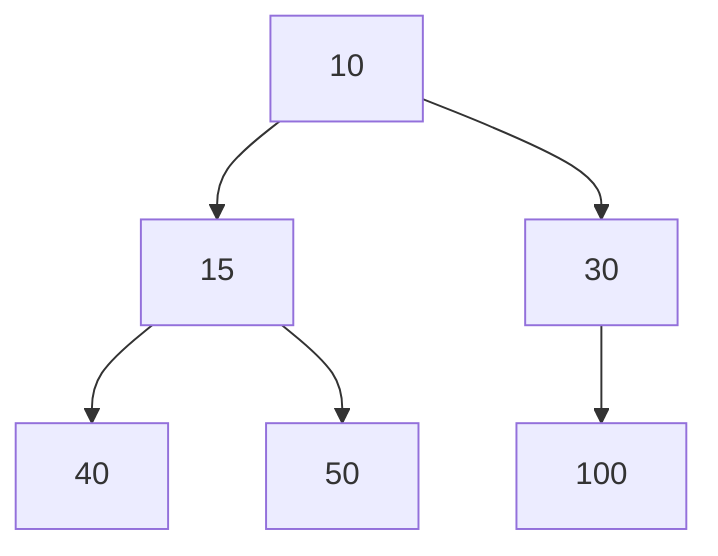

# Heaps

A heap is a specialized tree-based data structure that satisfies the heap property:

- In a min-heap the parent is always <= its children (root is the minimum element).
- In a max-heap the parent is always >= its children (root is the maximum element).

Heaps are commonly used to implement priority queues, and they provide fast access to the smallest (or largest) element. A binary heap is usually stored in an array and supports the main operations in logarithmic time.



Most questions regarding heaps follow a similar pattern (extract-min/extract-max, push, build-heap, replace). This repository uses Python; the stdlib `heapq` module implements a min-heap efficiently. Below are the common `heapq` functions and short notes/examples.

1. heapq.heappop(heap)

	- Description: Remove and return the smallest item from the heap.
	- Complexity: O(log n) because the heap must be rebalanced after removal.
	- Errors: Raises `IndexError` if the heap is empty.

	Example:

	```python
	import heapq

	heap = [1, 3, 5]
	heapq.heapify(heap)  # ensure it's a heap
	smallest = heapq.heappop(heap)  # returns 1
	```

2. heapq.heappush(heap, item)

	- Description: Push a new item onto the heap, maintaining the heap invariant.
	- Complexity: O(log n).

	Example:

	```python
	heapq.heappush(heap, 2)  # heap now contains 2 as appropriate position
	```

3. heapq.heapify(x)

	- Description: Transform list `x` into a heap, in-place.
	- Complexity: O(n) — faster than repeated `heappush` calls.

	Example:

	```python
	data = [5, 3, 8, 1, 2]
	heapq.heapify(data)  # data is now a valid min-heap
	```

4. heapq.heappushpop(heap, item)

	- Description: Push `item` on the heap then pop and return the smallest item. More efficient than `heappush()` followed by `heappop()` because it only balances the heap once.
	- Complexity: O(log n)

	Example:

	```python
	val = heapq.heappushpop(heap, 4)
	# pushes 4 and pops the smallest element in one operation
	```

Notes and common patterns
- Max-heap: `heapq` is a min-heap by default. To simulate a max-heap, push negative values (e.g., `heapq.heappush(h, -val)`), or wrap items in a dataclass that defines ordering.
- Build vs incremental: use `heapify()` when you have an initial list (O(n)). Use `heappush()` for incremental inserts.
- Use `heapq.nlargest()` / `heapq.nsmallest()` for convenient top-k operations (they use heaps under the hood when appropriate).

## Implementations

1. [Implementation.py](Implementation.py) Implementation of heap operations

## Practice Exercises

1. [01_kth_largest.py](practice_exercises/01_kth_largest.py) - Practice: Find the k-th largest element using a heap.
2. [02_k_closest.py](practice_exercises/02_k_closest.py) - Practice: Find k closest points to the origin (use heap for top-k).
3. [03_k_freq.py](practice_exercises/03_k_freq.py) - Practice: Top-k frequent elements (use heap of frequencies).
4. [04_task_scheduler.py](practice_exercises/04_task_scheduler.py) - Practice: Task scheduler / cooldown problems (priority queue pattern).

