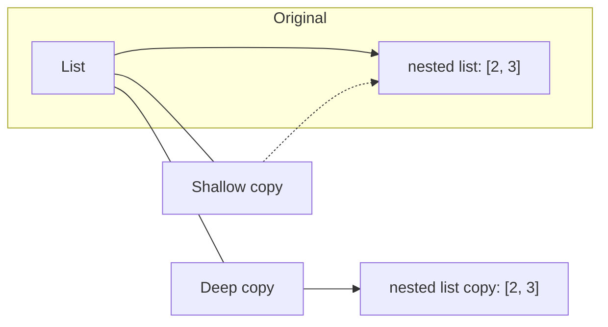

# Shallow vs Deep Clones in Python

- Shallow copy: creates a new container object, but the elements inside are references to the same objects as in the original container.
- Deep copy: creates a new container and recursively copies all nested objects so the new structure is independent of the original.

## Diagram (object/reference view)



In the diagram:
- The shallow copy points to the same nested object (`N1`) as the original.
- The deep copy points to a distinct nested object (`N2`) with the same contents.

## Minimal examples

Shallow copy behavior:

```python
import copy

orig = [1, [2, 3]]
shallow = orig.copy()          # or copy.copy(orig) or orig[:]

shallow[1].append(99)
print('orig after shallow change:', orig)   # -> [1, [2, 3, 99]] (inner list is shared)
```

Deep copy behavior:

```python
import copy

orig = [1, [2, 3]]
deep = copy.deepcopy(orig)

deep[1].append(42)
print('orig after deep change:', orig)   # -> [1, [2, 3]] (original unchanged)
```


