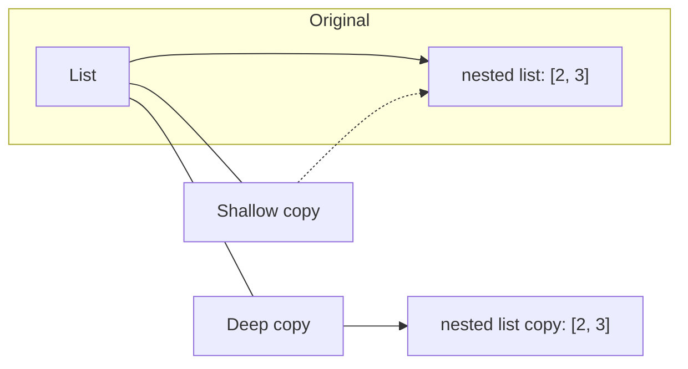

# Shallow vs Deep Clones in Python

This note explains the difference between shallow and deep copies in Python, shows a small object-reference diagram, and provides compact examples and practical tips.

## Quick definition
- Shallow copy: creates a new container object, but the elements inside are references to the same objects as in the original container.
- Deep copy: creates a new container and recursively copies all nested objects so the new structure is independent of the original.

## Diagram (object/reference view)



In the diagram:
- The shallow copy points to the same nested object (`N1`) as the original.
- The deep copy points to a distinct nested object (`N2`) with the same contents.

## Minimal examples

Shallow copy behavior:

```python
import copy

orig = [1, [2, 3]]
shallow = orig.copy()          # or copy.copy(orig) or orig[:]

shallow[1].append(99)
print('orig after shallow change:', orig)   # -> [1, [2, 3, 99]] (inner list is shared)
```

Deep copy behavior:

```python
import copy

orig = [1, [2, 3]]
deep = copy.deepcopy(orig)

deep[1].append(42)
print('orig after deep change:', orig)   # -> [1, [2, 3]] (original unchanged)
```

## Key points & edge cases
- Shallow copies are cheap because they copy only the top-level container; deep copies recursively duplicate nested objects and can be expensive (time + memory).
- Immutable objects (ints, strings, tuples of immutables) are safe to share: copying them isn't necessary.
- Use `copy.copy(x)` or container-specific methods (`list.copy()`, slicing, `dict.copy()`) for shallow copies.
- Use `copy.deepcopy(x)` for full independence. `deepcopy` handles cyclic references by tracking already-copied objects.
- Custom objects can control deep-copy behavior by implementing `__deepcopy__`.
- Beware large or complex object graphs: deep copying can be slow and memory-heavy. Consider designing immutable structures or performing targeted/partial copies instead.

## When to choose which
- Use shallow copy when you need a new top-level container but want to share nested immutable data or intentionally share nested mutable objects.
- Use deep copy when you must modify nested mutable objects without affecting the original and need full independence of the object graph.

## Quick checklist
- Are there nested mutable objects you’ll modify independently? → Use `copy.deepcopy`.
- Are nested objects immutable or safe to share? → Use a shallow copy (`list.copy()`, `dict.copy()`, `copy.copy`).
- Is performance/memory tight and the structure is large? → Avoid deep copy; consider redesign or manual partial copy.

---


